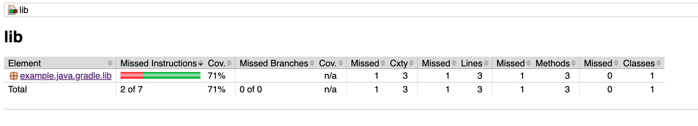
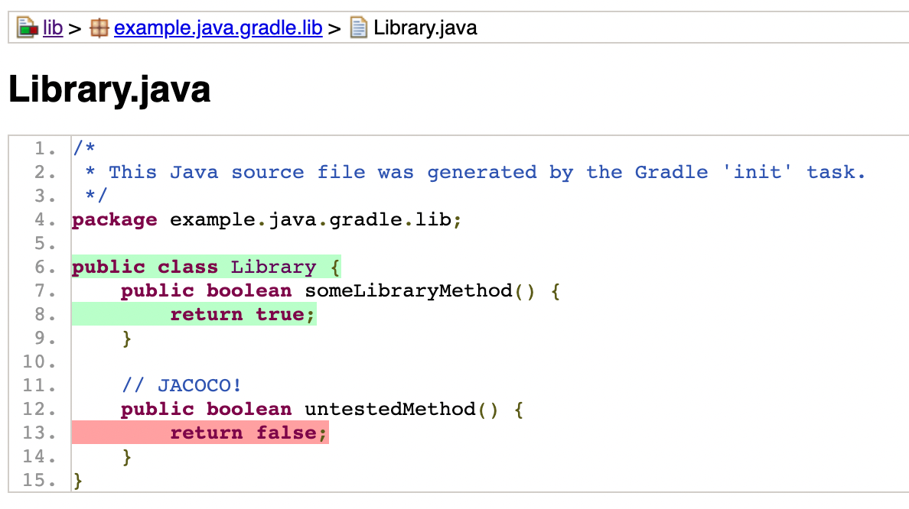
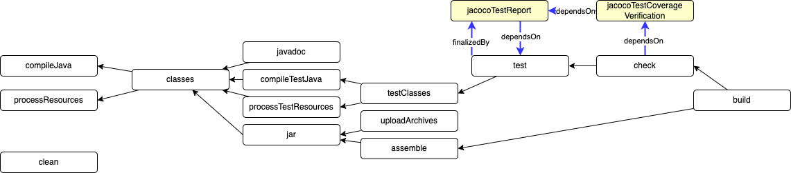
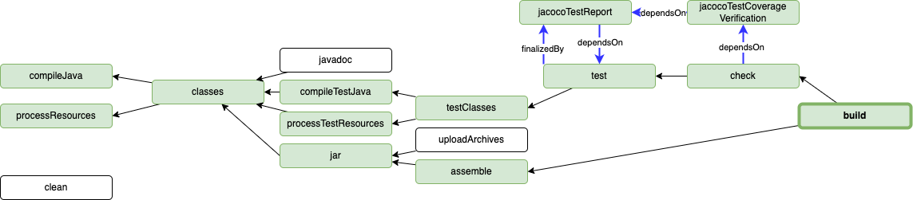
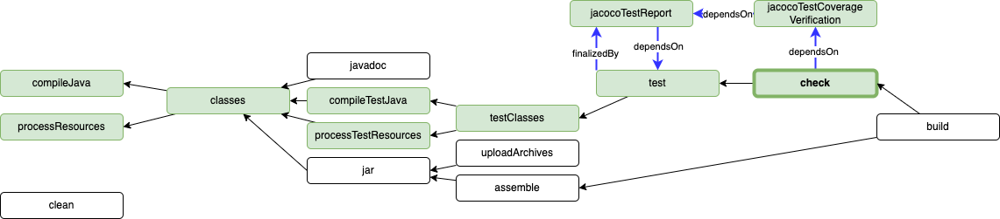
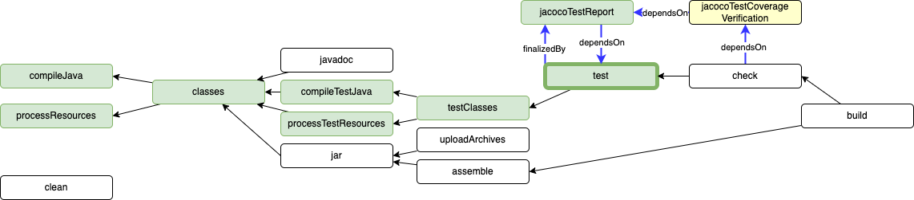

# Example Java Library using Gradle: Part 2

The purpose of this project is to be a basic Java library that is built using Gradle, with the intention of showing how to add both code coverage reporting and code coverage enforcement to the build lifecycle.

Prerequisites

- Git Setup: https://github.com/jvalentino/setup-git
- Building Java 101: https://github.com/jvalentino/java-building-101
- Gradle-Java Part 1: https://github.com/jvalentino/example-java-gradle-lib-1

# (1) What is Code Coverage?

> Code coverage tools will use one or more criteria to determine how your code was exercised or not during the execution of your test suite. The common metrics that you might see mentioned in your coverage reports include:
>
> - **Function coverage:** how many of the functions defined have been called.
> - **Statement coverage:** how many of the statements in the program have been executed.
> - **Branches coverage:** how many of the branches of the control structures (if statements for instance) have been executed.
> - **Condition coverage:** how many of the boolean sub-expressions have been tested for a true and a false value.
> - **Line coverage:** how many of lines of source code have been tested.
>
> These metrics are usually represented as the number of items actually tested, the items found in your code, and a coverage percentage (items tested / items found).

- https://www.atlassian.com/continuous-delivery/software-testing/code-coverage

# (2) What is Jacoco?

> **Java code coverage tools** are of two types: first, tools that add statements to the [Java](https://en.wikipedia.org/wiki/Java_(programming_language)) [source code](https://en.wikipedia.org/wiki/Source_code) and require its recompilation. Second, tools that instrument the [bytecode](https://en.wikipedia.org/wiki/Bytecode), either before or during execution. The goal is to find out which parts of the code are tested by registering the lines of [code executed](https://en.wikipedia.org/wiki/Code_coverage) when running a test.

- https://en.wikipedia.org/wiki/Java_code_coverage_tools

# (3) How do I use it in Gradle?

## Library.java

Since we already have 100% coverage, we want to add an untested method to show what it looks like:

```java
package example.java.gradle.lib;

public class Library {
    public boolean someLibraryMethod() {
        return true;
    }

    // JACOCO!
    public boolean untestedMethod() {
        return false;
    }
}
```

## lib/build.gradle

Next we have to make some changes to the build.gradle:

```groovy
plugins {
    // Apply the java-library plugin for API and implementation separation.
    id 'java-library'
    // JACACO!
    id 'jacoco'
}

// ...

// JACACO!
test {
    finalizedBy jacocoTestReport // report is always generated after tests run
}
jacocoTestReport {
    dependsOn test // tests are required to run before generating the report
}

jacocoTestCoverageVerification {
    dependsOn jacocoTestReport
    violationRules {
        rule {
            limit {
                minimum = 0.5
            }
        }
    }
}

check {
    dependsOn jacocoTestCoverageVerification
}
```

# (4) Running it

```bash
$ ./gradlew clean build -i
> Configure project :lib
> Task :lib:clean
> Task :lib:compileJava
> Task :lib:processResources NO-SOURCE
> Task :lib:classes
> Task :lib:jar
> Task :lib:assemble
> Task :lib:compileTestJava
> Task :lib:processTestResources NO-SOURCE
> Task :lib:testClasses
> Task :lib:test

> Task :lib:jacocoTestReport
> Task :lib:jacocoTestCoverageVerification

> Task :lib:check
> Task :lib:build
```

This shows that two new tasks are now a part of the build lifecycle:

- jacocoTestReport - Generates the report
- jacocoTestCoverageVerification - enforces the coverage

You can specifically find a website to dive into the coverage details at lib/build/reports/jacoco/html/index.html





Note that if you were to adjust the minimum coverage threshold higher and cause a failure, it would look like this:


# (5) How does all this work?



# (6) Why did we do it this way?

From a CI perspective: `./gradlew build` is what we intend to run to build the jar in question, which includes all of our automation



From an "I'm am messing with this locally perspective", you have `./gradlew check` (or build) to just run all the automation with the validation.



However, if the validation fails, in this case due to code coverage, you need a way to run it without the verfification so you can use run `./gradlew test`:




